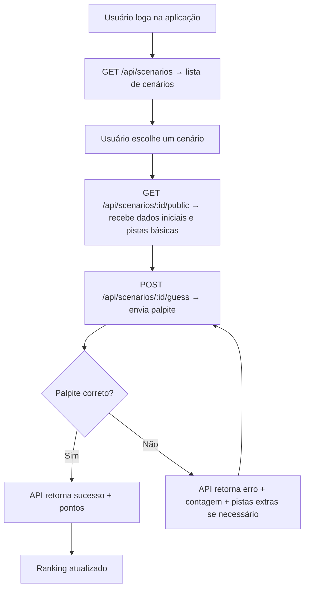

## Estrutura de Pastas do Projeto (Back-end)

Para um projeto Node.js + Express + TypeScript, uma estrutura clara poderia ser assim:

```bash
crime-guess/
│
├─ src/                  # Código fonte
│   ├─ controllers/      # Funções que lidam com lógica dos endpoints
│   ├─ routes/           # Definição das rotas da API
│   ├─ models/           # Modelos / ORM (ex: Prisma ou Sequelize)
│   ├─ services/         # Lógica de negócio (ex: calcular ranking)
│   ├─ middlewares/      # Middlewares Express (autenticação, validação)
│   ├─ utils/            # Funções utilitárias (ex: gerar id, formatar datas)
│   └─ app.ts            # Configuração do Express e rotas
│
├─ prisma/ (ou db/)      # Migrações e schema do banco (se usar ORM)
│
├─ tests/                # Testes unitários/integrados
│
├─ .env                  # Variáveis de ambiente
├─ .env.example          # Exemplo para compartilhamento
├─ package.json
├─ tsconfig.json         # Configuração do TypeScript
├─ .eslintrc.json        # Configuração ESLint
├─ .prettierrc           # Configuração Prettier
└─ README.md

```

# 🕹️ Documentação — Fluxo do Jogo _Crime Guess_

## 🎯 Objetivo do jogo

O jogador precisa **descobrir o assassino, a arma e o local** de um crime.
Ele recebe **pistas** que ajudam a deduzir a combinação correta.
Quanto menos tentativas ele fizer, **maior será sua pontuação final**.

---

## 🧩 Estrutura geral do jogo

Cada _cenário_ contém:

- 🧑‍🤝‍🧑 **3 suspeitos**
- 🔪 **3 armas**
- 🏠 **3 locais**
- 🕵️‍♂️ **1 combinação correta** (assassino + arma + local)
- 💬 **Pistas progressivas** (liberadas conforme o jogador erra)

---

## ⚙️ Mecânica de funcionamento

| Ação              | Descrição                                                                                             |
| ----------------- | ----------------------------------------------------------------------------------------------------- |
| Início de partida | O jogador escolhe um cenário. Recebe a lista de suspeitos, armas e locais, além de pistas iniciais.   |
| Tentativa         | O jogador envia um palpite com (suspeito, arma e local).                                              |
| Validação         | A API compara o palpite com a solução correta e retorna se o palpite está certo ou errado.            |
| Pistas extras     | A cada 2 erros, o jogador recebe uma pista nova.                                                      |
| Pontuação         | Se acertar na primeira tentativa, ganha mais pontos. A pontuação cai conforme o número de tentativas. |
| Ranking           | Cada jogador acumula pontos e aparece no ranking global.                                              |

---

## 🧠 Cálculo de Pontuação

| Tentativa                      | Pontos ganhos       |
| ------------------------------ | ------------------- |
| 1ª tentativa                   | 100 pontos          |
| 2ª tentativa                   | 80 pontos           |
| 3ª tentativa                   | 60 pontos           |
| 4ª tentativa                   | 40 pontos           |
| 5ª ou mais                     | 20 pontos           |
| Acertos após muitas tentativas | mínimo de 10 pontos |
| Não acerta                     | 0 pontos            |

💡 As pontuações serão ajustáveis futuramente via variáveis de configuração.

---

## 🧱 Entidades principais (Banco e API)

### 👤 Usuário

| Campo            | Tipo          | Descrição                |
| ---------------- | ------------- | ------------------------ |
| id               | UUID          | Identificador único      |
| username         | string        | Nome do jogador          |
| email            | string        | Login                    |
| password         | string (hash) | Senha criptografada      |
| score_total      | int           | Pontuação acumulada      |
| solved_scenarios | int           | Quantos cenários acertou |

---

### 🧩 Cenário

| Campo     | Tipo   | Descrição                              |
| --------- | ------ | -------------------------------------- |
| id        | UUID   | Identificador                          |
| title     | string | Nome ou tema do caso                   |
| suspects  | array  | Lista de 3 suspeitos                   |
| weapons   | array  | Lista de 3 armas                       |
| locations | array  | Lista de 3 locais                      |
| clues     | array  | Pistas progressivas                    |
| solution  | object | { suspect_id, weapon_id, location_id } |

---

### 🎮 Tentativa

| Campo          | Tipo      | Descrição                 |
| -------------- | --------- | ------------------------- |
| id             | UUID      | Identificador             |
| user_id        | UUID      | Jogador que tentou        |
| scenario_id    | UUID      | Cenário relacionado       |
| attempt_number | int       | Número da tentativa       |
| guess          | object    | Palpite do jogador        |
| correct        | boolean   | Se o palpite estava certo |
| created_at     | timestamp | Data da tentativa         |

---

## 🔁 Fluxo de jogo (visão API)



---

## 🧭 Regras de progresso

- O jogador **pode jogar o mesmo cenário várias vezes**, mas só a **primeira vez que acertar** conta para o ranking.
- Se ele quiser tentar novamente, será **uma “partida casual”** (sem pontuação no ranking).
- Cada cenário pode ter **níveis de dificuldade**, ajustando:
  - Número de pistas iniciais;
  - Densidade de detalhes nas pistas;
  - Peso de pontuação.

---

## 📊 Ranking

| Métrica                        | Descrição                                                       |
| ------------------------------ | --------------------------------------------------------------- |
| Total de pontos                | Soma dos pontos obtidos nos cenários                            |
| Média de tentativas por acerto | Indicador de precisão do jogador                                |
| Posição no ranking             | Ordenado por pontuação total (e depois por média de tentativas) |

---

## 🧩 Telas / Rotas no Front-end (planejamento futuro)

| Tela              | Descrição                                           |
| ----------------- | --------------------------------------------------- |
| 🏠 Home           | Mostra os cenários disponíveis e o ranking resumido |
| 🕵️‍♂️ Cenário        | Tela do jogo (pistas, tentativas, envio de palpite) |
| 🧩 Resultado      | Mostra se acertou, pontuação e ranking parcial      |
| 🧑‍💻 Login/Register | Autenticação do usuário                             |
| 🧮 Ranking        | Ranking completo e estatísticas                     |

---

## 💡 Futuras melhorias

- Sistema de **dificuldade dinâmica** (pistas variando conforme o desempenho do jogador)
- **Cenários criados pela comunidade**
- **Modo cooperativo** (vários jogadores tentam resolver o mesmo caso)
- Integração com **API externa de temas** (ex: gerar crimes aleatórios)
- **Sistema de conquistas / badges**
